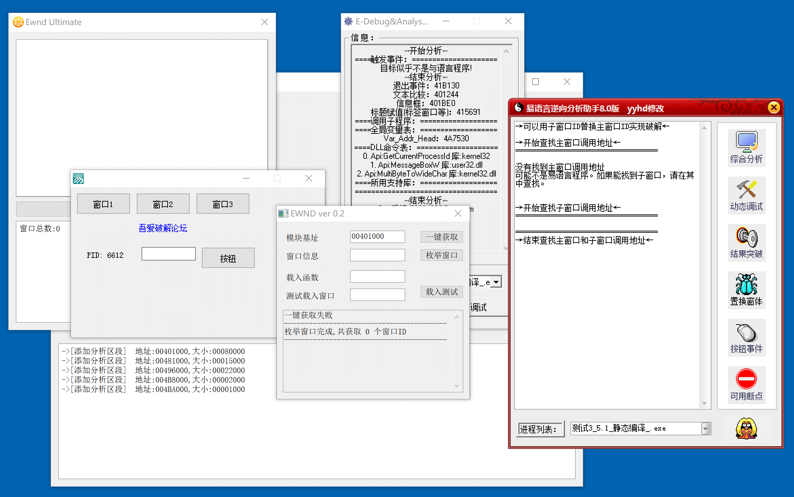

# ELangPatcher

针对易语言静态编译的代码进行轻微混淆处理，避免被插件一键识别关键函数。

注意该轻微膨胀/混淆只能用来对抗现有的“一键识别”工具，不能和加密壳的效果比。

如果你能拿到这类工具的源码缝缝补补，应该也能让它重新识别。

## 原理

对已知的部分特征进行魔改，大部分时候都是对简单操作进行膨胀，然后开辟新的内存空间跳转过去。

因为生成代码计算绝对地址比较麻烦，所以依赖 CALL 指令入栈的地址来计算正确跳转位置。

## 处理过的特征

只处理了一小部分特征。手动整起来太麻烦了，感觉不如利用特征码自动标记然后上加密壳批量处理了。

- 对抗 [EWnd v0.2] 插件的一键分析
- 对抗 [EWnd Ultimate] 插件的一键分析
- 对抗 [E-Debug] 程序/插件的一键分析
- 对抗 [E-Decompiler] 插件的一键分析
- 对抗 [易语言逆向分析助手] 的窗体信息分析
- 对抗易语言初始化入口识别（`cld; fninit; call xxxx`）
- 对抗控件处理事件识别（重写了个简单的，混淆程度不高 `call dword[ebp - 4]`）
- 处理了找到的一些乱七八糟的特征…

[EWnd Ultimate]: https://www.52pojie.cn/thread-1466188-1-1.html
[EWnd v0.2]: https://www.52pojie.cn/thread-396634-1-1.html
[E-Debug]: https://www.52pojie.cn/thread-1527446-1-1.html
[E-Decompiler]: https://www.52pojie.cn/thread-1684608-1-1.html
[易语言逆向分析助手]: https://www.52pojie.cn/thread-1586374-1-1.html

## 碎碎念

- 易语言的编译顺序太“稳定”了，可以通过定位目标函数附近的函数来快速定位。
- 没处理过特征的函数依然可以手动检索特征码找到。
- 再做下去感觉需要自动化识别函数、反编译、然后随机混淆/膨胀了。
  - 要考虑的东西太多了，不适合我。

## 致谢

- [fjqisba 老师的易语言逆向专栏]
- [易语言程序分析笔记 - 看雪/PlaneJun]

[fjqisba 老师的易语言逆向专栏]: https://fjqisba.github.io/categories/%E6%98%93%E8%AF%AD%E8%A8%80%E9%80%86%E5%90%91/
[易语言程序分析笔记 - 看雪/PlaneJun]: https://bbs.kanxue.com/thread-274503.htm
